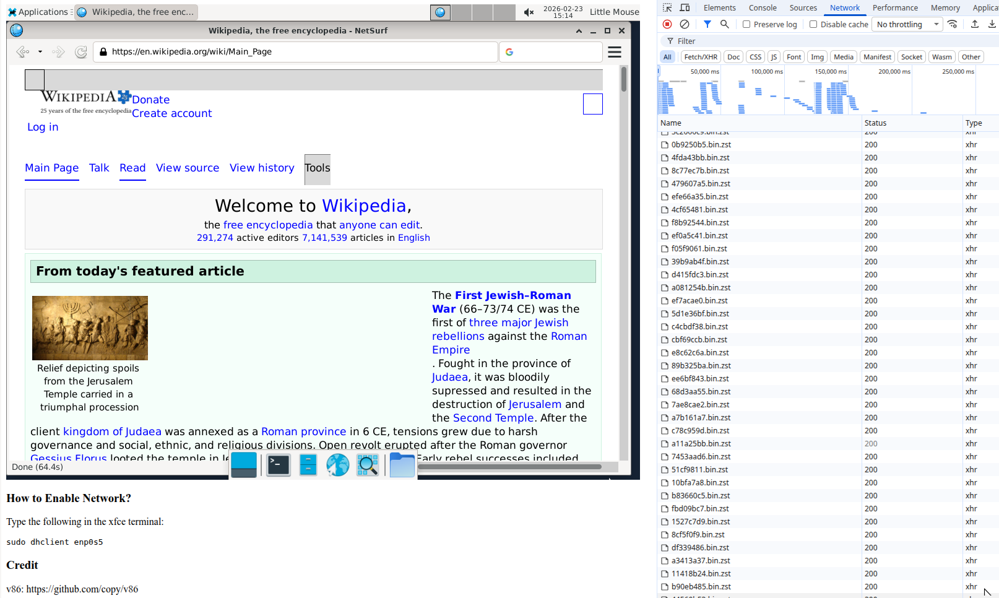

Scientific Lab in Browser

Screenshot:

How to build:

- clone this project
- run `cd tools/docker/LinuxDE`
- run `./build.sh`
- run `./build-state.js`
- run `cp split.sh ../../../images/split.sh`
- run `cd ../../../images`
- run `./split.sh`
- run `rm debian-9p-rootfs.tar debian-state-base.bin`
- run `cd ..`
- run `make run`

  This should start a server on 8000 (or other ports).

Credit:
- v86: https://github.com/copy/v86
- All opensource software installed
